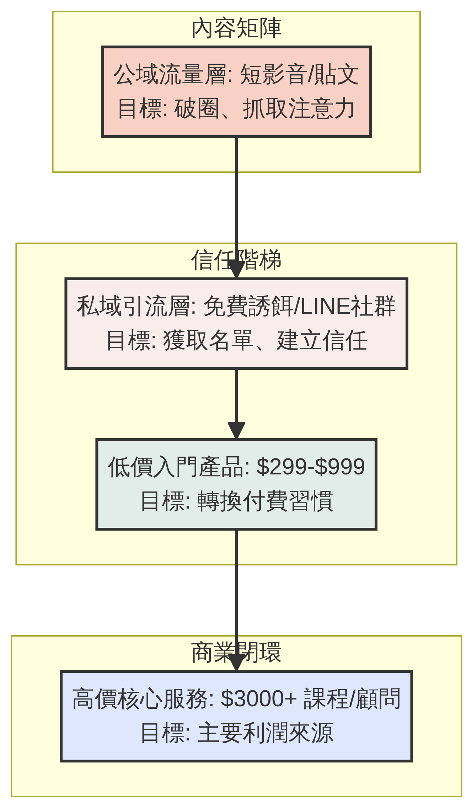

# 個人 IP 成功系統（2026 無懈可擊終極版）

> **這套系統解決了 90% 創作者的痛點：「有流量，沒變現」。我們不談空泛的影響力，只談如何設計一條從「陌生人」到「高價客戶」的精準路徑。**

---

## 全局視覺化：個人 IP 商業變現漏斗

做 IP 的第一天，你就必須把這個漏斗畫在白板上。沒有後端的變現產品，前端的流量只是虛榮指標。

### 1. 內容矩陣 (60%)：公域流量層
- **戰場：** TikTok、IG Reels、YT Shorts。
- **目標：** 破圈、洗流量、抓取注意力。
- **內容形式：** 時事評論、迷因梗圖、反直覺的短影音。
- **關鍵心法：** 這裡不需要太深奧的專業知識，你需要的是「共鳴」。讓觀眾覺得「天啊，這就是在說我」。

### 2. 信任階梯 (30%)：私域引流層
- **戰場：** LINE 官方帳號、封閉式 FB 社團、Email 電子報。
- **目標：** 將公域的「租來流量」轉化為你可以隨時觸及的「自有資產」。
- **內容形式：** 深度圖文、直播、免費高價值誘餌（如：PDF 檢查表、模板）。
- **關鍵心法：** 不要直接賣東西。提供一個能解決他們「具體小痛點」的免費工具，換取他們的聯絡方式。

### 3. 商業閉環 (10%)：變現層
- **戰場：** 銷售頁 (Landing Page)、一對一諮詢、線上課程平台。
- **目標：** 產生實際營收。
- **產品設計：**
  - **入門產品 (Tripwire)：** 價格極低（$299-$999），目的不是賺錢，而是打破「免費索取」的習慣，讓他們拿出信用卡。
  - **核心產品 (Core Offer)：** 主要利潤來源（$3000-$10000），如線上課程、年度會員。
  - **高階服務 (High-Ticket)：** 針對金字塔頂端（$50000+），如一對一教練、企業內訓。

---

## 實戰模組：2026 台灣市場「反脆弱人設」公式

過去的 IP 追求完美，現在的 IP 必須「真實且立體」。完美的專家會被 AI 取代，有血有肉的人不會。

### 立體人設矩陣 = 專業 (60%) + 標籤 (20%) + 弱點 (20%)

| 元素 | 作用 | 台灣本土範例設計 |
|------|------|-----------------|
| **專業 (The Expert)** | 建立信任的基石，解決問題的能力。 | 「幫助傳產轉型數位化的電商顧問」 |
| **標籤 (The Hook)** | 記憶點，讓人在 3 秒內記住你。 | 「永遠穿花襯衫、開場必喝一口黑咖啡」 |
| **弱點 (The Flaw)** | 消除距離感，引發同情與共鳴。 | 「雖然懂電商，但自己是個嚴重的路痴，常迷路」 |

**台灣市場禁忌：** 絕對不要用「高高在上、說教、炫富」的姿態。台灣觀眾極度吃「草根、自嘲、真誠分享」這一套。

---

## 實戰模組：SOP 化內容產出系統

IP 經營最怕靈感枯竭。你不需要每天想新點子，你需要的是「內容裂變系統」。

### 1 變 10 的裂變法則

假設你有一個核心觀點：「中小企業不該一開始就花大錢做 APP」。

1. **長篇內容 (1 篇)：** 寫一篇 1500 字的深度電子報或部落格文章，詳細分析成本與風險。
2. **短影音 (3 支)：**
   - 影片 A（痛點鉤子）：「花 100 萬做 APP？這是中小企業最常踩的坑。」
   - 影片 B（案例鉤子）：「我客戶堅持做 APP，結果半年後公司差點倒閉。」
   - 影片 C（解法鉤子）：「不用寫程式，這 3 個工具幫你零成本驗證商業模式。」
3. **圖文輪播 (2 篇)：** 將文章內容整理成 IG 懶人包。
4. **短語錄/金句 (4 則)：** 發佈在 Threads 或 Twitter，測試市場反應。

### 數據焦慮防禦機制
- **不要看單支影片的播放量。**
- **要看「轉換率」：** 1 萬播放量帶來 10 個付費客戶，遠勝於 100 萬播放量帶來 0 個客戶。
- **建立「不看數據日」：** 每週規定自己有兩天絕對不打開後台數據，專心創作與服務既有客戶。
