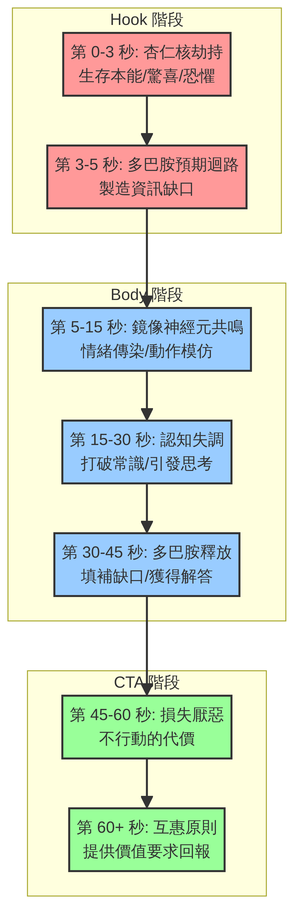
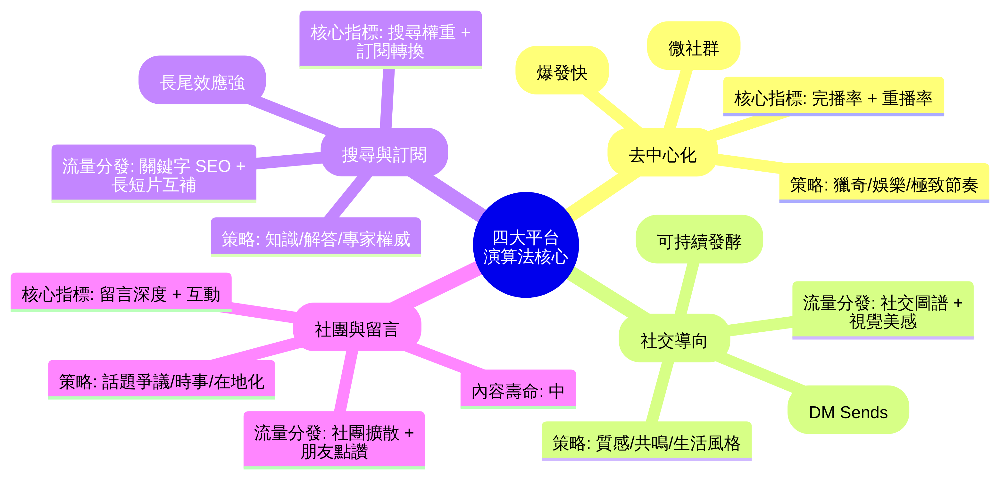

# 台灣頂尖短影音成功系統（2026 無懈可擊終極版）

> **這不是另一份「理論整理」，而是基於神經科學、四大平台最新演算法、以及台灣本土市場實戰經驗淬鍊出的「操作說明書」。**

---

## 全局視覺化：神經科學逐秒大腦狀態設計圖

短影音的本質，是「注意力工程學」。你不是在剪輯影片，你是在設計觀眾大腦中化學物質的釋放節奏。

### 1. 杏仁核劫持（第 0-3 秒）
- **科學原理：** 大腦的杏仁核負責處理生存威脅與強烈情緒。當遇到突發視覺或聽覺刺激時，杏仁核會強制大腦「暫停」手邊動作（停止滑動）。
- **實戰應用：** 視覺錘必須在此刻落下。突兀的動作（突然靠近鏡頭）、強烈的顏色對比、或打破常規的聲音（不是平淡的開場白）。

### 2. 多巴胺預期迴路（第 3-5 秒）
- **科學原理：** 根據 Loewenstein 的「資訊缺口理論」，當人意識到自己「不知道某件事」時，大腦會產生不適感，並分泌多巴胺驅使你去尋找答案。
- **實戰應用：** 語言釘必須在此刻說出。提出一個違反常理的問題或大膽宣言（例如：「不要再吃水煮蛋減肥了，那會讓你更胖」），製造巨大的資訊缺口。

### 3. 鏡像神經元共鳴（第 5-15 秒）
- **科學原理：** 看到別人展現情緒或動作時，大腦的鏡像神經元會模擬相同的狀態（情緒傳染）。
- **實戰應用：** 表情必須放大。如果你要講一個痛苦的經歷，你的眉頭必須皺起；你要講一個驚喜的發現，你的眼睛必須睜大。觀眾會透過螢幕「感受」到你的情緒。

### 4. 認知失調與多巴胺釋放（第 15-45 秒）
- **科學原理：** 挑戰觀眾既有的常識會引發「認知失調」，為了解除這種不適，他們會繼續看下去。當你給出合理的解釋填補了資訊缺口，大腦會釋放多巴胺作為獎勵。
- **實戰應用：** Body 段落不要給平庸的答案。必須是「反直覺但合理」的解法。

### 5. 損失厭惡與互惠原則（第 45-60 秒）
- **科學原理：** 人類對「失去」的痛苦感是「獲得」的兩倍。
- **實戰應用：** CTA 的設計不要說「按讚可以學到更多」，要說「不把這支影片存下來，你明天去超市又會買錯」。

---

## 全局視覺化：四大平台演算法核心差異

不要用同一支影片、同一個邏輯打天下。2026 年，四大平台已經完全分化。

| 平台 | 核心指標 | 流量分發邏輯 | 最佳內容策略 |
|------|---------|-------------|-------------|
| **TikTok** | 完播率 + 重播率 | 極致去中心化。靠「興趣標籤」精準推播給陌生人。 | 節奏極快、視覺衝擊強、娛樂性或獵奇性高。 |
| **IG Reels** | 私訊分享 (DM Sends) | 社交圖譜優先。系統看重「這支影片會不會被傳給朋友」。 | 視覺質感高、生活風格強、能引發「這就是在說你」的共鳴。 |
| **YT Shorts** | 搜尋權重 + 訂閱轉換 | 搜尋引擎邏輯。長尾效應最強，幾個月後還能帶來流量。 | 知識解答、乾貨教學、專家權威建立。必須優化標題與描述。 |
| **FB Reels** | 留言深度 + 互動 | 社團與朋友圈擴散。受眾年齡層偏高。 | 在地化話題、時事爭議、能引發長篇留言討論的內容。 |

---

## 實戰模組：台灣市場 12 大產業鉤子配方表

這是在台灣市場，經過無數廣告費與有機流量測試後，存活下來的「最強起手式」。

### 【服務與體驗類】
1. **餐飲業**
   - **視覺錘：** 筷子夾起食物牽絲/爆汁的特寫（0.5秒） + 誇張的咀嚼聲。
   - **鉤子公式：** 「[地名] 人太幸福了吧！這家隱藏版 [食物]，沒有在地人帶路根本找不到！」
2. **美容/美髮業**
   - **視覺錘：** 極度糟糕的 Before 畫面（布丁頭/爛痘臉）突然切換到完美的 After。
   - **鉤子公式：** 「千萬不要隨便 [做某項療程]，除非你想體驗 [誇張的正面結果]。」
3. **醫美診所**
   - **視覺錘：** 醫師穿著白袍，手持某種儀器探頭直指鏡頭。
   - **鉤子公式：** 「做 [某療程] 前沒人告訴你的 3 個秘密，不想白花錢一定要看。」

### 【產品與零售類】
4. **服飾配件**
   - **視覺錘：** 同一件衣服，路人穿 vs. 模特穿的殘酷對比。
   - **鉤子公式：** 「微胖女孩別再穿 [某單品] 了！換成這件，視覺直接瘦 5 公斤。」
5. **3C/家電**
   - **視覺錘：** 把產品摔在地上/泡在水裡等極端測試畫面。
   - **鉤子公式：** 「我原本以為 [某產品] 是智商稅，直到我實測了 [極端情境]...」
6. **保健食品**
   - **視覺錘：** 疲憊不堪的上班族倒在桌上。
   - **鉤子公式：** 「每天睡滿 8 小時還是累？你缺的可能不是睡眠，而是 [某營養素]。」

### 【知識與專業類】
7. **線上課程/培訓**
   - **視覺錘：** 秀出真實的後台收益截圖或銀行入帳通知。
   - **鉤子公式：** 「我花了 [時間] 和 [金錢] 買到的教訓，今天 1 分鐘免費告訴你。」
8. **房地產/仲介**
   - **視覺錘：** 站在豪宅落地窗前，或極度破爛的漏水屋內。
   - **鉤子公式：** 「月薪 [數字] 在 [地名] 買得起房嗎？帶你看這間 [特點] 的案子。」
9. **金融理財**
   - **視覺錘：** 撕掉帳單或計算機狂按的畫面。
   - **鉤子公式：** 「銀行絕對不會告訴你的 [某理財漏洞]，再不改你一輩子存不到錢。」

### 【其他利基市場】
10. **寵物業**
    - **視覺錘：** 寵物做出極度人性化或搞笑的崩壞表情。
    - **鉤子公式：** 「你以為你家 [寵物] 是在撒嬌？其實牠是在 [某種反常識的科學解釋]。」
11. **汽車/機車**
    - **視覺錘：** 第一視角的極速儀表板或引擎聲浪。
    - **鉤子公式：** 「預算 [數字]，買 [車款A] 還是 [車款B]？懂車的人都選這個。」
12. **家具/裝潢**
    - **視覺錘：** 亂七八糟的房間，一個響指瞬間變成無印良品風。
    - **鉤子公式：** 「租屋族必看！只花 [小金額]，把 3 坪狗窩爆改成質感套房。」

---

## 避坑指南：無效影片的 5 大致命傷

在我們未來的拆解系統中，如果發現以下特徵，這支影片/廣告就會被標記為「無效」或「具備高風險」：

1. **資訊密度過低：** 前 5 秒只有背景音樂和風景，沒有任何文字或口白提示主題。
2. **視覺與聽覺脫節：** 畫面在展示產品，但配音在講完全不相關的人生哲理（大腦無法處理衝突資訊）。
3. **說教感太重：** 創作者居高臨下地指責觀眾（「你就是因為這樣才失敗」），在台灣市場會引發強烈反感。
4. **CTA 模糊或過多：** 結尾同時要求「按讚、留言、分享、點主頁連結」。大腦面對過多選擇時的預設反應是「什麼都不做」。
5. **偽原生的生硬廣告：** 假裝是素人推薦，但台詞充滿專業術語和官方宣傳語，3 秒內就會被觀眾識破並滑走。
